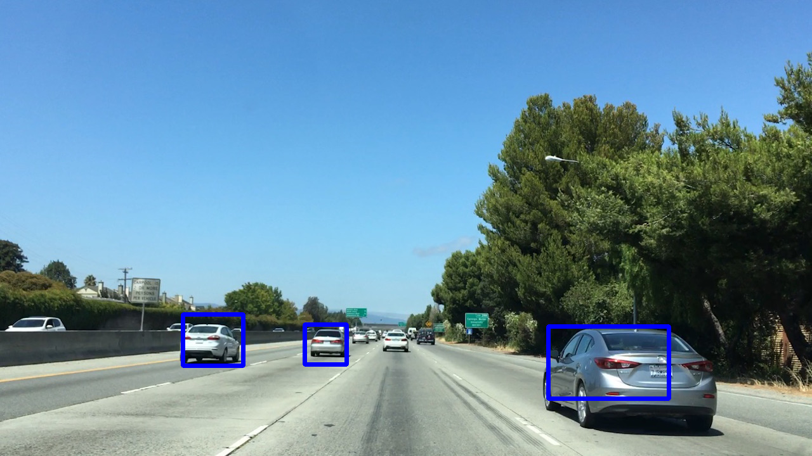
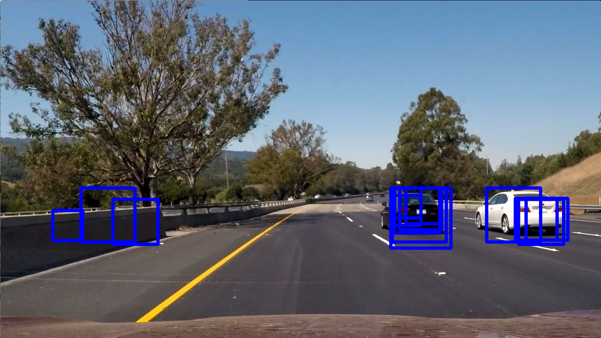

# **Vehicle Detection Project**


## Kemal Tepe, ketepe@gmail.com

### Objective: Objective of this work is to utilize machine learning techniques to identify and classify nearby vehicles in the driving.

### Summary: 

In this project, a linear SVM based classifier is used to identify and classify surrounding vehicles in a video captured during driving conditions. In order to achieve the project objectives, the classifier is trained by using nearly 16,000 images of cars and non-cars, which are roughly equally distributed. The classifier trained by using image features such as color space and histogram oriented gradient (HOG). After obtaining classifier model, the video frames are searched for possible vehicles. In this process, patch (windows) of images from the video frames are processed and fed into the classifier for predictions. If the classifier identifies a vehicle in a particular path (window), this patch is labeled as HOT. The hot windows are used to generate heat map to remove the false positives where classifier identifies non-vehicle objects and vehicles.  Another method to mitigate false positives is to use smoothing filter, where we used consecutive heat maps by using a moving average type filter. The classifier yields roughly 96% accuracy in the test phase. The classifier worked well in most of the cases but it occasionally identifies very close proximity vehicles as one car, and some side rails as vehicles. A better training set, such as pictures with more railing can train the model better to eliminate these false positives. Overall, the detection and classification works well in this project. Enhancements and improvements are possible and discussed in the last section of this report. The implementation can also be optimized for number of ways to increase computational efficiency, for example exact number of different scales, as well as reduction in the feature set generation to speed up the processing without sacrificing the accuracy.

The code is in ```hog_classifier_ket_movie.py``` and most of the helper functions are in ```lecture_functions.py``` files.

### The goals / steps of this project are the following:

* Perform a Histogram of Oriented Gradients (HOG) feature extraction on a labeled training set of images and train a classifier Linear SVM classifier

* Implement a sliding-window technique and use your trained classifier to search for vehicles in images.

* Run your pipeline on a video stream and create a heat map of recurring detections frame by frame to reject outliers and follow detected vehicles.

* Discuss future enhancements.

### 1. Perform a Histogram of Oriented Gradients (HOG) feature extraction on a labeled training set of images and train a classifier Linear SVM classifier

In order to utilize machine learning (ML) methods, we need a well organized data det. We have obtained this through the resources section of the module. The data set used in this part of the project is obtained from [GTI vehicle image database]( http://www.gti.ssr.upm.es/data/Vehicle_database.html). The set contains roughly equal number of vehicles and non-vehicles images (8,000 images in each category) with 64x64 pixels per image. Some samples are provided below.

 *non-vehicle*
 *vehicle*
 *non-vehicle*
 *vehicle 

HOG features are extracted from the training images by using functions provided by `skimage.hog()` which was the main function in ```lecture_functions.py``` provided by Udacity, the function API is
```python
features = hog(img, orientations=orient,
                       pixels_per_cell=(pix_per_cell, pix_per_cell),
                       cells_per_block=(cell_per_block, cell_per_block), block_norm='L2-Hys',
                       transform_sqrt=True,
                       visualise=vis, feature_vector=feature_vec)
```

Tuning and identifying right combination of parameters to obtain the features were important. I have used the following parameters in my feature extraction:
```python
color_space = 'YCrCb' # Can be RGB, HSV, LUV, HLS, YUV, YCrCb
orient = 9
pix_per_cell = 8
#cell_per_block = 2
cell_per_block = 1
hog_channel = "ALL" # Can be 0, 1, 2, or "ALL"
spatial_size = (32, 32)  # Spatial binning dimensions
hist_bins = 32  # Number of histogram bins
spatial_feat = True  # Spatial features on or off
hist_feat = True  # Histogram features on or off
hog_feat = True  # HOG features on or off
```

**Explain how you settled on your final choice of HOG parameters**.

In the final classification, `color_space`, and `cell_per_block` parameters were important also including all the channels in `hog_channels`. I experimented with **RGB** color space as well as cell per block parameters. Color space with **YCrCB** and cell block size of 1 was provided 2-3% higher accuracy during testing. My observations were also verified by few blogs that I read such as by [Arnoldo Guzzi](https://chatbotslife.com/vehicle-detection-and-tracking-using-computer-vision-baea4df65906). This blog's author did extensive testing in these parameters. Although he suggests orientation of 8, my classifier worked with orientation of 9 better. 

### 2. Implement a sliding-window technique and use your trained classifier to search for vehicles in images.

**Training classifier**

After extracting HOG features, a linear SVM is trained to obtain the classifier model. The code which trains the classifier and generates the model is given below:

```python
if (os.path.isfile(model_file))==False:
    print('model file is not found, moving to training mode')
    svc = LinearSVC()
    # Check the training time for the SVC
    t=time.time()
    svc.fit(X_train, y_train)
    t2 = time.time()
    print(round(t2-t, 2), 'Seconds to train SVC...')
    #  Check the score of the SVC
    # print('Test Accuracy of SVC = ', round(svc.score(X_test, y_test), 4))
    #  Check the prediction time for a single sample
    t=time.time()
    n_predict = 10
    print('My SVC predicts: ', svc.predict(X_test[0:n_predict]))
    print('For these',n_predict, 'labels: ', y_test[0:n_predict])
    t2 = time.time()
    print(round(t2-t, 5), 'Seconds to predict', n_predict,'labels with SVC')
    #pickle the model
    joblib.dump(svc, model_file)
    #joblib.dump(X_scaler, 'X_scaler_model2.p')
    # #pickle.dump(svc, open('svc_model.p', 'wb'))
else:
    print('using the stored model file', model_file)
    svc=joblib.load(model_file)
# technically this is done
```

Trained model is saved to a file to be used in the future. This also allowed us to reduce run time during the testing and fine tuning the image and video processing phases. 

Before the training scaling has been done with StandardScaler().

**Sliding Window Search**

The sliding window search was essential to comb the video frames to find the vehicles using the trained classifier. The primary function to perform this sliding windows approach is ```find_cars()``` given below:

```python
scales = [1.0, 1.2, 1.4, 1.5, 1.8, 2]
box_list = []
for scale in scales:
        out_img, hot_boxes, conf_scores = find_cars(img, ystart, ystop, scale, svc, X_scaler, orient, pix_per_cell, cell_per_block, spatial_size,

```

```find_cars``` function searches entire image file with 50% overlap with different window scales. Window scale of one constitutes 64x64 pixel window. I have tried variety of scales however scales less than 1 did not help to identify vehicles. So I settled on window scales of 
```scales = [1.0, 1.2, 1.4, 1.5, 1.8, 2]```. 

While sliding window method is searching each box for a vehicle, if the classifier identifies a vehicle by its prediction, the function retains this box as hot, meaning that the window contains a vehicle. After all the scales are searched, the hot boxes are provided to heat map methods to eliminate false positives. The pipeline for the entire process is defined in ```frame_process``` function. The pipeline of the python code is provided below:

```python
#smoothing
sample_img = mpimg.imread('./sample/bbox-example-image.jpg')
asmooth_filter=np.zeros((sample_img.shape[0], sample_img.shape[1], 9)).astype(np.float)
filter_counter=0

def frame_process(img):
    global asmooth_filter, filter_counter
    ystart = 400
    ystop = 680
    #scales = [1.0, 1.5, 1.8, 2] #works good
    scales = [1.0, 1.2, 1.4, 1.5, 1.8, 2]
    box_list = []
    for scale in scales:
        out_img, hot_boxes, conf_scores = find_cars(img, ystart, ystop, scale, svc, X_scaler, orient, pix_per_cell, cell_per_block, spatial_size,
                                       hist_bins)
    #transfer hot boxes to the box_list for heat map
        for i in range(len(hot_boxes)):
            box_=hot_boxes[i]
            if conf_scores[i] >= 1.0:
                box_list.append(box_)

    heat = np.zeros_like(img[:, :, 0]).astype(np.float)
    # Add heat to each box in box list
    heat = add_heat(heat, box_list)
    # Apply threshold to help remove false positives
    # 7 works good
    asmooth_filter[:,:,filter_counter]=heat
    filter_counter=(filter_counter+1)%9
    heat = np.zeros_like(img[:, :, 0]).astype(np.float)
    for i in range(9):
        heat=heat+asmooth_filter[:,:,i]
    heat=heat/9.0
    heat_thr=7
    if debug_prt:
        print('filter_conter, heat: mean, max, var, stdev', filter_counter, "{0:.2f}".format(heat.mean()), "{0:.2f}".format(heat.max()),
              "{0:.2f}".format(np.sqrt(heat.var())),
              'smooth filter: mean, max, var', "{0:.2f}".format(asmooth_filter.mean()), "{0:.2f}".format(asmooth_filter.max()),
              "{0:.2f}".format(np.sqrt(asmooth_filter.var())), "{0:.2f}".format(heat_thr))
    #heat_thr=smooth_filter.mean()+6.0*np.sqrt(smooth_filter.var())
    heat = apply_threshold(heat, heat_thr)
    # Visualize the heatmap when displaying
    heatmap = np.clip(heat, 0, 255)
    # Find final boxes from heatmap using label function
    labels = label(heatmap)
    boxes=labels_to_boxes(labels)
    print(boxes)
    new_boxes=[]
    for box in boxes:
        x_size, y_size = box_size(box)
        if x_size > 24 and y_size > 24:
            print(box, x_size, y_size)
            new_boxes.append(box)
    draw_img = draw_boxes(img, new_boxes)

    return draw_img
```

The pipeline was tested with number of different test images, where samples are shown below in different stages of the pipeline.

*Vehicles in the image in raw form where all the hot boxes are shown.*
*Vehicles in the image after heat map tresholding to reduce the number of false positives*
*Heat map of the hot boxes, which identify concentration of  identification to select vehicles to reduce the false positives.*

Another test image:

*Vehicles in the image in raw form where all the hot boxes are shown.*
*Vehicles in the image after heat map tresholding to reduce the number of false positives*
*Heat map of the hot boxes, which identify concentration of  identification to select vehicles to reduce the false positives, notice the false positive at the railing.*

**Response to comments made by the reviewer for this section:** In order to improve robustness, I used the reviewers suggested method and I modified ```find_cars``` function to return the confidence score for each hot box using ```conf_score = svc.decision_function(test_features)```, then the pipeline only uses hot boxes whose confidence score exceeds a threshold. A threshold of 1.0 seems to yield a reasonably well. I obtained this value by trial and error by changing values from 0.5 to 2.0 at 0.5 steps. With this modification, majority of the false positives are eliminated. Another method was also suggested by the reviewer is to eliminate small boxes which cannot hold a vehicle. I used 24x24 pixels as the threshold, this also eliminated most of the small boxes. With that, the new still images provides much robust detection method.

### 3. Run your pipeline on a video stream and create a heat map of recurring detections frame by frame to reject outliers and follow detected vehicles.

The pipeline provided in Section 2 is used in processing the video files to identify vehicle in the video frames. However in order to identify vehicles better as well as utilize information from frame to frame, a smoothing method, is applied while obtaining the heat maps. Below the section of the pipeline where this smoothing was implemented is provided.

```python
#smoothing
sample_img = mpimg.imread('./sample/bbox-example-image.jpg')
smooth_filter=np.zeros_like(sample_img[:,:,0]).astype(np.float)
asmooth_filter=np.zeros((sample_img.shape[0], sample_img.shape[1], 9)).astype(np.float)
filter_counter=0

def frame_process(img):
    ....
    
    heat = np.zeros_like(img[:, :, 0]).astype(np.float)
    # Add heat to each box in box list
    heat = add_heat(heat, box_list)
    # Apply threshold to help remove false positives
    # 7 works good
    asmooth_filter[:,:,filter_counter]=heat
    filter_counter=(filter_counter+1)%9
    heat = np.zeros_like(img[:, :, 0]).astype(np.float)
    for i in range(9):
        heat=heat+asmooth_filter[:,:,i]
    heat=heat/9.0
    ....
    heat = apply_threshold(heat, heat_thr)
    ....
```

The smoothing filter is in this 2nd submission uses 10 last last frames heat maps and averages them to provide continuity.
That method of smoothing significantly reduced false positive detections. 

The output of the pipeline with the project movie clip is given below. There are moments that false positives as well as false negatives, where the classifier identifies non-vehicles as vehicle and fails to identify vehicles are present. However these are rare and the classifier achieves a successful identification of the vehicles most of the time. The full video clip of the pipeline output is provided below.

[Link to project video result](./P5_ket_out_full.mp4)*Video output of previous pipeline, with moving average smoothing, and **no** confidence score and small box removals*

[Link to project video result](./P5_ket_out_full_new.mp4)*Video output of previous pipeline, with moving average smoothing, and **no** confidence score and small box removals*

**Response to comments made by the reviewer for this section:** Above mentioned smoothing filter that averages heat maps of 10 last frames is implemented in order to improve robustness. This suggestion by the review team was great and it worked well in the video processing.

(1) Smoothing, (2) confidence score filtering, as well as (3) eliminating small hot boxes from the detections nearly eliminated all the false positives. This is evidenced by the videos provided with earlier pipeline and new pipeline. 

There are few occasions the shadows generate false positives but increasing the confidence score threshold eliminated even these in my trials but this also increased true negatives. Finding this fine line threshold would require more time to test out. Also another approach which I suggested by review team as well as I thought too is to increase number of training images from these areas to allow classifier to learn these troubled sections that they are not vehicle or identify another feature differentiates these areas and vehicles. Both I plan to investigate as my future work.


### 4. Discussions and Future Work

#### Briefly discuss any problems / issues you faced in your implementation of this project.  Where will your pipeline likely fail?  What could you do to make it more robust?

Overall, SVM worked well in identifying and classifying cars and non-cars. The following problems have been faced.

* Although Linear SVM was used, few other methods could be integrated simultaneously to eliminate false positives. One of the techniques could be using tree search algorithms where some obvious image features could be used to eliminate non-cars from the pool before the classifier.

* The other problem was that the classifier generated relatively high number of false positives around highway middle railings, which separates the highway lanes, and around the road signs. In order to eliminate these false positives, the classifier could be further trained by images of railings and road-signs to better model them and identify them in the frames.

* The classifier can also be trained with more images of vehicles to enhance its model to reduce false positives. I am not convinced that 8000 images is enough to capture every possible scenario also using only 64x64 pixel images may not be the best set to train the classifier. The set is practical but far from ideal.

* Although the project was about SVM classifier, I also wonder (and will probably try) how a convolutional neural network (CNNs) will classify the vehicles in this project. We had a good success with road-sign detection with CNNs, and replacing SVM with CNN can yield a better results, however may also require more training time and larger training set. 

* Also better tracking the vehicles from frame to frame is needed and can be implemented. This will transfer useful information frame to frame with in the pipeline, similar to what we have used in Advanced Line Detection project with Line() class. This will allow us to search boxes identified hot in the previous frame first and adjust the search algorithm to look these areas more closely, and keeping a record of these (hot) boxes would significantly improve the robustness of the detection and classification, similar to Markov process.

The project was very educational and interesting to work on. I will keep working on this to fine tune in future to increase the robustness. 


